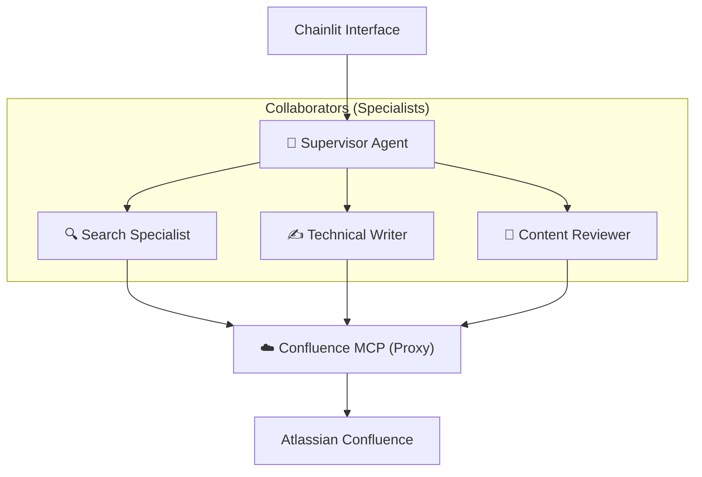

# Phase 4.3: AWS Bedrock Multi-Agent System (MAS)

This document describes the implementation of the Confluence Multi-Agent System using native AWS Bedrock Supervisor and Collaborator features.

## 🧭 Architecture: Supervisor & Specialist Roles

The system has evolved from a monolithic agent to a structured hierarchy of specialists, allowing for higher accuracy, better grounding, and specialized tool access.

### Agent Personas

| Agent | Icon | Role & Responsibility |
|-------|------|------------------------|
| **Supervisor** | 🧭 | The Orchestrator. Analyzes intent and routes Tasks to specialists. Manages overall conversation flow. |
| **Search Agent** | 🔍 | Information Retrieval. Specialized in finding, reading, and deep-linking Confluence pages. |
| **Writer Agent** | ✍️ | Content Creation. Skilled in XHTML formatting. Must obtain approval from the Reviewer before publishing. |
| **Reviewer Agent** | 🔎 | Quality Gate. Reviews drafts for structure, clarity, and XHTML validity against provided context. |

## 🧠 Memory & History Sharing

One of the key breakthroughs in this Phase is the enablement of **Conversation History Sharing** (`relayConversationHistory` set to `TO_COLLABORATOR`).

### How Context is Passed
When the user says: *"Create a page in space AR under parent 12345"*, and then in the next turn says: *"The title should be Team Goals"*:
1.  **Supervisor** retains the session state.
2.  **Supervisor** shares the relevant history (Space/Parent) with the **Writer Agent**.
3.  **Writer Agent** uses that inherited context to execute the `create_confluence_page` tool without needing the user to repeat the parameters.

## 🚀 Usage Guide

### Example Workflow: Creation & Update
- **User**: "I want to create a documentation page in the AR space."
- **Supervisor**: (Delegates to Search to find a parent) "I found the Engineering Home page (ID: 41123863). Should I put it there?"
- **User**: "Yes. Title is 'API Strategy' and content is 'Modernizing our endpoints'."
- **Supervisor**: (Delegates to Writer) "I've created the page for you!"

### Best Practices for Prompts
- **Be Specific about Goal**: "Search for X", "Review this draft", "Draft a new page".
- **Leverage Multi-turn**: You don't need to provide all IDs in the first message; the system will guide you through the required parameters.

## 🛠️ Infrastructure Details

- **Terraform Managed**: All agents, collaborators, and action groups are defined in `terraform/main.tf`.
- **Lambda Bridge**: All agents share a single IAM role and communicate with the MCP server via the `ConfluenceTools` proxy.
- **Strict Grounding**: System instructions force agents to prioritize Confluence data over internal LLM knowledge.

---
**Maintained by**: Antigravity AI  
**Last Updated**: 2026-02-22
