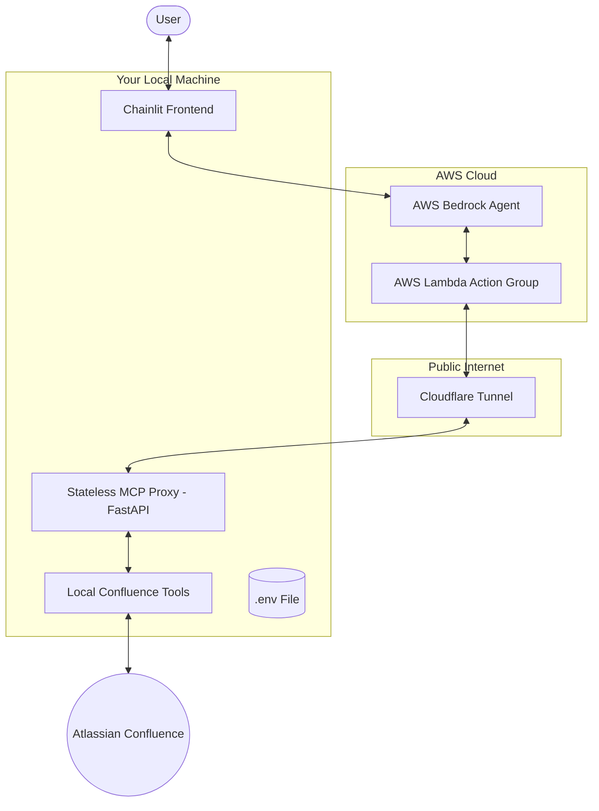
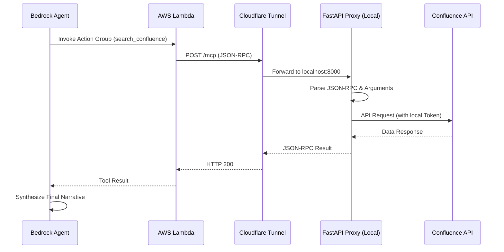

# Confluence MCP: Hybrid Cloud-Local Integration Guide

This guide explains the architecture, setup, and usage of the Confluence MCP integration using AWS Bedrock and Cloudflare Tunnels.

## 1. Architecture Overview (Learning)

The system uses a **Hybrid Cloud-Local** model. This allows you to leverage powerful cloud-based AI orchestration while keeping your sensitive corporate data and credentials entirely on your local machine.

### High-Level Architecture


### Request Flow
1.  **User** sends a message to the **Chainlit UI**.
2.  **Chainlit** invokes the **AWS Bedrock Agent**.
3.  **Bedrock** determines it needs to search Confluence and calls the **Action Group** (Lambda).
4.  **Lambda** sends a JSON-RPC `tools/call` request to the specific **Cloudflare Tunnel URL**.
5.  **Cloudflare** routes the request to the **FastAPI Proxy** running on your laptop.
6.  **FastAPI Proxy** executes the local python tool using your locally stored **Confluence API Token**.
7.  The response flows back through the tunnel to Bedrock, which incorporates the Confluence data into its final answer.

---

## 2. Setup Instructions

### Prerequisites
*   **AWS Account**: Access to Bedrock (Claude 3 Haiku enabled) and basic IAM permissions.
*   **Cloudflare Account**: For creating "Quick Tunnels" (free, no account required for basic use).
*   **Confluence API Token**: Generated from your Atlassian account.
*   **Python 3.10+** and `terraform` installed.

### Configuration
1.  **Environment Variables**: Create a `.env` file in the root directory:
    ```bash
    CONFLUENCE_BASE_URL=https://your-domain.atlassian.net
    CONFLUENCE_EMAIL=your-email@example.com
    CONFLUENCE_API_TOKEN=your-api-token
    ```
2.  **Access Control**: Edit `config.json` to define which spaces and parent pages the AI is allowed to access.

---

## 3. Usage Guide

### Step 1: Start the Local Proxy & Tunnel
Run the provided helper script to start both the FastAPI server and the Cloudflare tunnel:
```bash
./start_mcp_tunnel.sh
```
Watch the output for your unique tunnel URL (e.g., `https://example.trycloudflare.com`).

### Step 2: Deploy/Update Infrastructure
If your tunnel URL has changed, update `terraform/main.tf` with the new `CLOUDFLARE_URL` and apply:
```bash
cd terraform
terraform apply -auto-approve
```

### Step 3: Launch the UI
Start the Chainlit frontend:
```bash
chainlit run src/confluence_mcp/agent/app.py
```
Open your browser to `http://localhost:8000` (or the port shown in the terminal) and start chatting!

---

## 4. Technical Details (Deep Dive)

### Stateless MCP Proxy
The file `src/confluence_mcp/http_server/fastapi_server.py` implements a minimal, stateless bridge. 

Unlike standard MCP servers that require a stateful `initialize` handshake, this proxy is designed for **serverless environments** (like AWS Lambda). It accepts direct JSON-RPC payloads, executes the tool, and returns the result in a single request/response cycle.

### Sequence Diagram: Tool Execution


### Why this architecture?
1.  **Zero Trust**: Your Atlassian credentials never touch the AWS cloud.
2.  **Ease of Deployment**: No complex VPC peering or VPNs required to connect your private VM to AWS.
3.  **Cost Effective**: Uses free Cloudflare Tunnels and serverless Lambda (pay-per-invocation).
