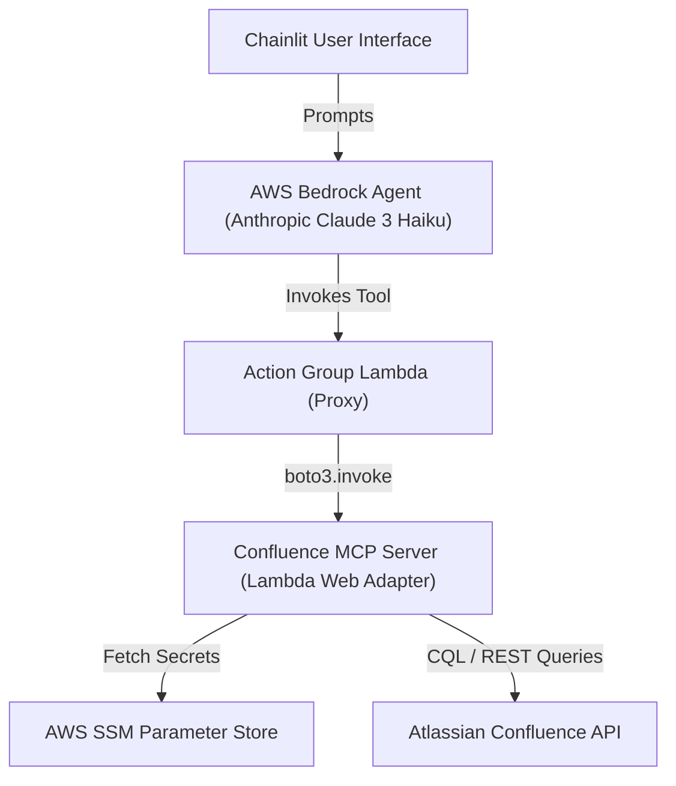

# Phase 4 Guide: Serverless Cloud Architecture

This document describes the Phase 4 architecture, which migrated the Confluence MCP server from a local-tunnel setup to a fully native AWS serverless environment.

## 🏗️ High-Level Architecture

The system follows a "Bridge" pattern where an AWS Bedrock Agent orchestrates tools by invoking a Lambda function, which then delegates to a containerized MCP server running in another Lambda.

## 🔐 Security & Authentication

### 1. Identity and Access Management (IAM)
- **Action Group Proxy**: Has `lambda:InvokeFunction` permissions for the `ConfluenceMCPServer` Lambda.
- **MCP Server**: Has `ssm:GetParameters` permissions to retrieve the Confluence API token and credentials.
- **Bedrock Agent**: Has `lambda:InvokeFunction` permissions for the `ConfluenceTools` (Proxy) Lambda.

### 2. Communication Security
- The communication between the Proxy and the Server happens **internally** within the AWS network using the standard `boto3.invoke` mechanism. This avoids the need for public endpoints or complex SigV4 header signing for raw HTTP requests.

### 3. Secret Management
- Confluence credentials are stored in **AWS SSM Parameter Store** with encryption enabled.
- Parameters:
  - `/confluence/base_url`
  - `/confluence/email`
  - `/confluence/api_token`

## ⚙️ Component Details

### MCP Server Lambda
- **Runtime**: Python 3.11 (Container Image)
- **Adapter**: [AWS Lambda Web Adapter](https://github.com/awslabs/aws-lambda-web-adapter)
- **Framework**: FastAPI + FastMCP
- **Architecture**: `arm64` (Graviton) for cost-efficiency.

### Action Group Proxy
- **Runtime**: Python 3.11 (Zip)
- **Role**: Maps the Bedrock Action Group event schema to the JSON-RPC schema expected by the MCP server.
- **Protocol**: Converts Bedrock's name/value parameters into a standard `tools/call` MCP request.

## 🚀 Setup & Execution

### Build and Push (MCP Server)
1. Build the Docker image specifically for `linux/arm64`.
2. Push to AWS ECR.
3. Update the Lambda function code with the new image URI.

### Environment Management
- The system is managed via **Terraform** (located in `/terraform`).
- Local secrets can be pushed to SSM using the `scripts/push_secrets_to_ssm.sh` script.

---
**Maintained by**: Antigravity AI
**Last Updated**: 2026-02-22
